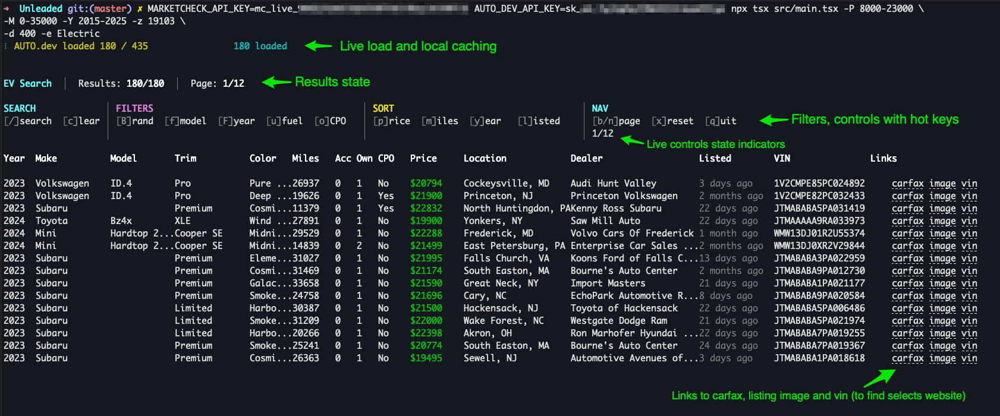

# Unleaded

Unleaded is a terminal interface for searching live used-car listings from [auto.dev](https://www.auto.dev/) and [MarketCheck](https://www.marketcheck.com/).


## Install

```bash
npm install --global @tradedal/unleaded
```

## Configure API access

Set one or both provider keys:

```bash
export AUTO_DEV_API_KEY=your-key
export MARKETCHECK_API_KEY=your-key
```

## Search

```bash
unleaded -z 90089 -d 100 -e Electric -b Hyundai -m Ioniq
```

Use `--state CA` without a ZIP for a statewide search. Run `unleaded --help` to list all search options.

## Terminal controls

The control bar lists the available shortcuts. Listing rows include links to the vehicle page, image, history report, and VIN search when the provider supplies them.



## Block dealers

```bash
unleaded block add "Example Motors"
unleaded block list
unleaded block remove "Example Motors"
unleaded block clear
```

## Development

```bash
yarn install
yarn compile
yarn test
```

The project uses TypeScript, Effect, Effect Atom, and Ink. It is licensed under [Apache 2.0](./LICENSE).

## Maintainers

Unleaded is maintained by [Tradedal](https://tradedal.com/), which develops financial research software and open-source tools.
